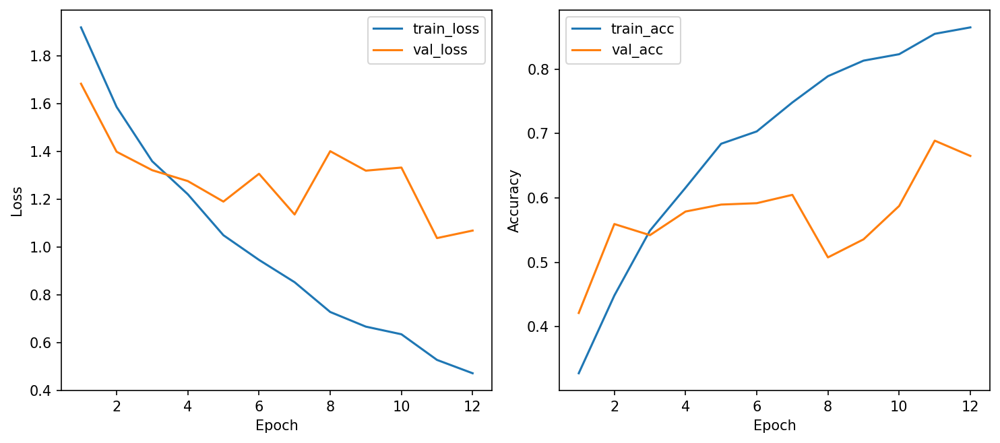
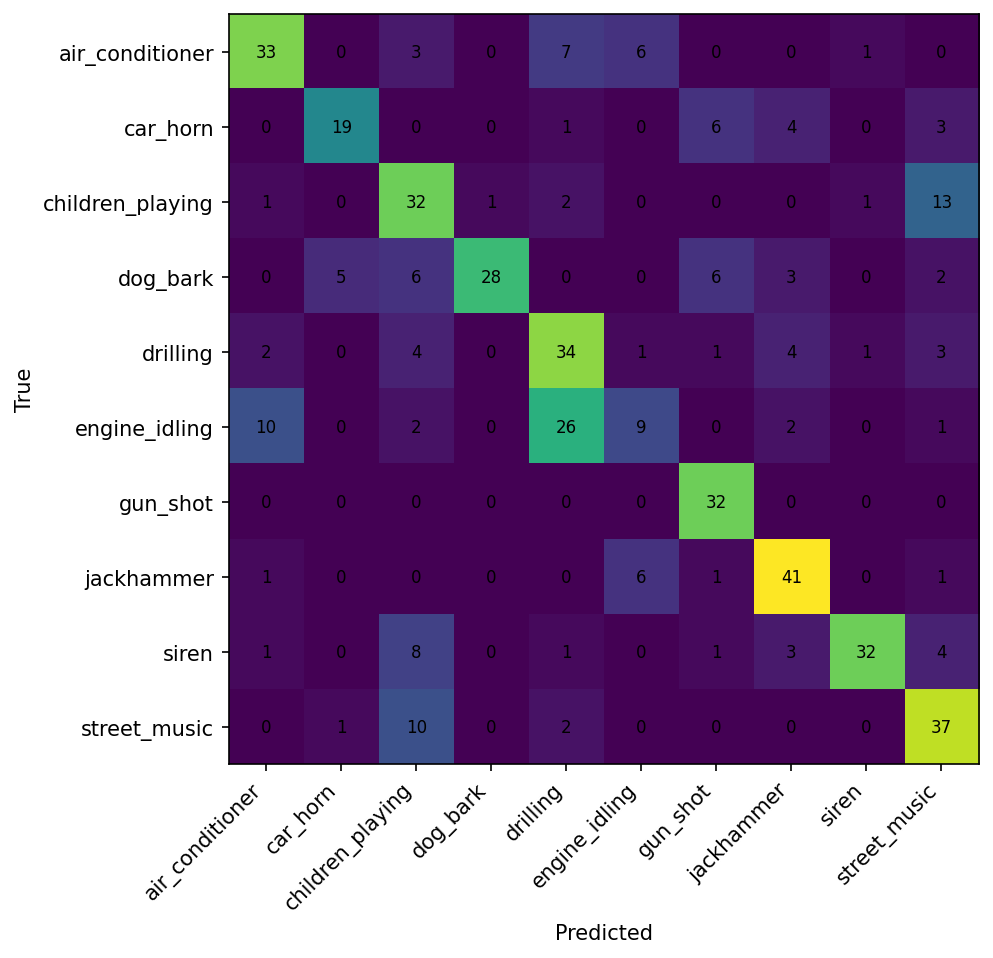

# CSC4005 Lab 3 Report – UrbanSound8K with 1D-CNN

## 1. Thông tin sinh viên

- Họ tên: Nguyễn Trung Thành
- Mã sinh viên: 1771040022
- Lớp: (chưa cập nhật)
- Link GitHub repo: https://github.com/FIT-DNU-CS-16-01/csc4005-lab3-1dcnn-thanh1771040022
- Link W&B run/project: https://wandb.ai/trungthanhk17/csc4005-lab3-urbansound-1dcnn

---

## 2. Mục tiêu thí nghiệm

- Phân loại 10 lớp âm thanh môi trường của UrbanSound8K.
- Chuẩn hóa audio về cùng sample rate và cùng độ dài trước khi trích xuất đặc trưng.
- Huấn luyện mô hình 1D-CNN trên chuỗi đặc trưng theo thời gian (MFCC/log-mel) và mở rộng với raw waveform.
- Theo dõi quá trình train/eval bằng W&B.
- Phân tích lỗi qua learning curves và confusion matrix.

---

## 3. Dữ liệu và tiền xử lý

### 3.1. Dataset

- Dataset: UrbanSound8K
- Số lớp: 10
- Các lớp: air_conditioner, car_horn, children_playing, dog_bark, drilling, engine_idling, gun_shot, jackhammer, siren, street_music
- Fold dùng để train: 1–8
- Fold dùng để validation: 9
- Fold dùng để test: 10

Kích thước dữ liệu thực tế theo `used_config.json`:
- Train: 1200 mẫu (giới hạn 120 mẫu/lớp)
- Validation: 463 mẫu
- Test: 465 mẫu

### 3.2. Tiền xử lý audio

Cấu hình run chính (log-mel):

| Thành phần | Giá trị |
|---|---|
| Sample rate | 16000 Hz |
| Duration | 4.0 giây |
| Feature type | logmel |
| n_mfcc / n_mels | n_mels = 64 |
| n_fft | 1024 |
| hop_length | 512 |
| Augmentation | Có (time mask + freq mask cho feature; bật ở train) |

Giải thích ngắn: cần đưa audio về cùng sample rate và cùng độ dài để mọi mẫu có cùng số điểm theo thời gian. Điều này giúp tensor đầu vào có shape nhất quán, giảm sai khác do định dạng ghi âm, và giúp mô hình học đặc trưng âm thanh thay vì học “nhiễu kỹ thuật” từ độ dài/tần số lấy mẫu khác nhau.

---

## 4. Mô hình 1D-CNN

Mô tả kiến trúc mô hình (feature-based 1D-CNN):

```text
Input feature sequence [B, C, T]
→ (Conv1D + BatchNorm + ReLU + MaxPool1D) x3
→ AdaptiveAvgPool1D(1)
→ Flatten
→ Dropout
→ Linear classifier
→ Softmax (trong suy luận)
```

Bảng cấu hình (run chính log-mel):

| Thành phần | Giá trị |
|---|---|
| model_name | logmel_1dcnn |
| hidden_channels | [64, 128, 128] |
| dropout | 0.35 |
| optimizer | AdamW |
| learning rate | 0.001 (giảm còn 0.0005 do ReduceLROnPlateau) |
| weight decay | 0.0001 |
| batch size | 32 |
| epochs | 12 |
| patience | 4 |

---

## 5. Kết quả thực nghiệm

### 5.1. Kết quả chính

Run chính được chọn để phân tích: **1771040022_logmel_1dcnn**

| Metric | Giá trị |
|---|---:|
| Best validation accuracy | 0.6890 |
| Test accuracy | 0.6387 |
| Average epoch time | 5.65 giây |
| Total parameters | 145,610 |
| Trainable parameters | 145,610 |

### 5.2. Learning curves



Nhận xét:

- Train loss giảm rõ rệt theo epoch; val loss dao động nhưng nhìn chung giảm về cuối và tốt nhất ở epoch 11.
- Có dấu hiệu overfitting nhẹ (train_acc tăng cao hơn nhiều so với val_acc ở các epoch cuối).
- Early stopping **không xảy ra** (run đi hết 12 epoch theo cấu hình).

### 5.3. Confusion matrix



Nhận xét:

- Lớp dễ phân loại: **gun_shot** (recall 1.00), **jackhammer** (recall 0.82).
- Lớp dễ bị nhầm: **engine_idling** (hay nhầm sang drilling/air_conditioner), **children_playing** (nhầm street_music).
- Nguyên nhân khả dĩ: các lớp có phổ tần và tính lặp theo thời gian gần nhau, có nhiễu nền đô thị, và dữ liệu clip ngắn 4 giây chưa đủ ngữ cảnh ở một số mẫu.

---

## 6. W&B tracking

Dán link W&B:

```text
Project: https://wandb.ai/trungthanhk17/csc4005-lab3-urbansound-1dcnn
MFCC baseline: https://wandb.ai/trungthanhk17/csc4005-lab3-urbansound-1dcnn/runs/6qyhntjh
log-mel: https://wandb.ai/trungthanhk17/csc4005-lab3-urbansound-1dcnn/runs/ezyaeoeb
raw waveform: https://wandb.ai/trungthanhk17/csc4005-lab3-urbansound-1dcnn/runs/fud4uou8
```

Dashboard có đầy đủ:

- learning curves theo epoch,
- final metrics (best_val_acc, test_acc, test_loss),
- cấu hình run (feature/model/hyperparameters),
- ảnh confusion matrix và curves.

---

## 7. Phân tích và thảo luận

1. **Vì sao dùng 1D-CNN thay vì MLP cho chuỗi đặc trưng audio?**  
   1D-CNN khai thác tính cục bộ theo thời gian (temporal locality), chia sẻ trọng số nên ít tham số hơn MLP, học mẫu ngắn hạn (onset, nhịp, biến thiên phổ) hiệu quả hơn.

2. **Kernel 1D trong bài này đang trượt theo chiều nào?**  
   Kernel trượt theo **chiều thời gian** `T` của chuỗi đặc trưng (MFCC/log-mel). Với raw waveform, kernel trượt theo trục mẫu tín hiệu.

3. **MFCC giúp mô hình học dễ hơn raw waveform ở điểm nào?**  
   MFCC nén thông tin phổ theo thang gần cảm nhận thính giác, giảm nhiễu và giảm kích thước đầu vào, nên tối ưu hóa ổn định hơn raw waveform trên CPU và dữ liệu giới hạn.

4. **Mô hình hiện tại còn hạn chế gì?**  
   Dùng dữ liệu giới hạn theo lớp (`max_train_per_class=120`), kiến trúc còn gọn, chưa dùng augmentation mạnh, và còn nhầm giữa các lớp có đặc trưng âm thanh gần nhau.

5. **Có thể cải thiện kết quả bằng cách nào?**  
   Tăng dữ liệu train (hoặc bỏ giới hạn per-class), tune `n_mels/hop_length`, thêm SpecAugment mạnh hơn, class-weight/focal loss, thử deeper 1D-CNN hoặc CRNN, và train lâu hơn với scheduler phù hợp.

---

## 8. Bài mở rộng nếu có

| Pipeline | Feature/Input | Test accuracy | Nhận xét |
|---|---|---:|---|
| Baseline | MFCC + 1D-CNN | 0.5548 | Học nhanh nhưng nhầm nhiều ở các lớp nền ồn. |
| Extension 1 | log-mel + 1D-CNN | 0.6387 | Tốt nhất trong 3 run; biểu diễn phổ mịn hơn MFCC trong run này. |
| Extension 2 | raw waveform + 1D-CNN | 0.5570 | Khó học hơn, thời gian train lâu hơn rõ rệt (~25.34s/epoch). |

---

## 9. Kết luận

- Pipeline UrbanSound8K (fold split + chuẩn hóa độ dài + trích xuất feature) đã chạy ổn định cho cả 3 cấu hình.
- 1D-CNN trên log-mel cho kết quả tốt nhất trong thí nghiệm này (test_acc 0.6387).
- Raw waveform 1D-CNN chạy được nhưng khó tối ưu hơn và tốn thời gian hơn trên CPU.
- Confusion matrix cho thấy các lớp có đặc trưng nền tương đồng vẫn là điểm nghẽn chính.
- W&B giúp theo dõi rõ quá trình học, so sánh run, và lưu minh chứng đầy đủ để báo cáo.
